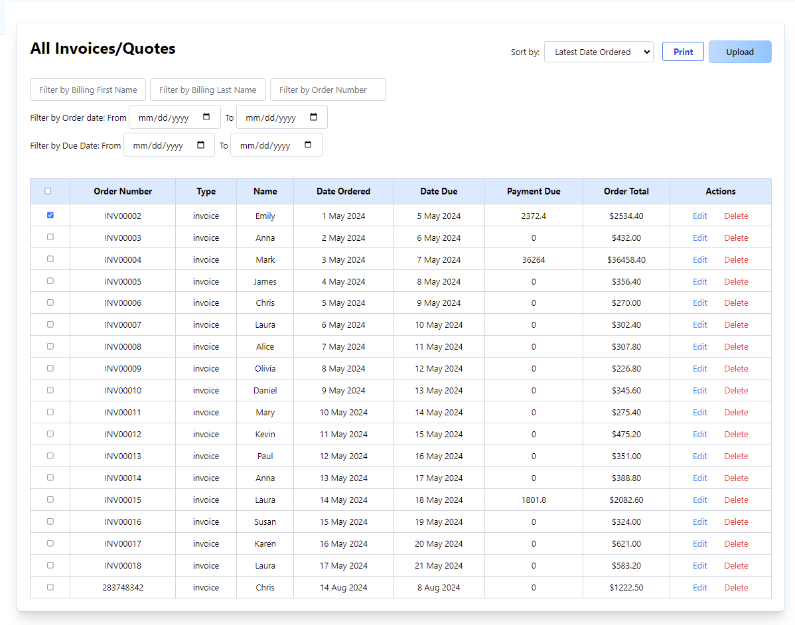

# MERN Invoicing Application

## Overview

This is a full-stack invoicing application built using the **MERN (MongoDB, Express, React, Node.js)** stack. The application allows users to create, manage, and print invoices efficiently. It supports authentication, and exporting invoices in **PDF** or **CSV** formats.

## Features

- **User authentication** (JWT-based login & registration)
- **Create, edit, and delete invoices**
- **Generate invoices in PDF format using jsPDF**
- **Export invoices to CSV using PapaParse**
- **Responsive UI built with React and Tailwind CSS**
- **API integration with MongoDB for data persistence**
- **File uploads using Multer**
- **Secure authentication with bcrypt.js**

## Tech Stack

### Backend (Server)
- Node.js
- Express.js
- MongoDB & Mongoose
- JWT for authentication
- bcrypt.js for password hashing
- Multer for file uploads

### Frontend (Client)
- React.js
- React Router for navigation
- Tailwind CSS for styling
- React Icons for UI enhancements
- jsPDF for PDF generation
- PapaParse for CSV export
- React-To-Print for invoice printing

## Installation

### Prerequisites
Ensure you have the following installed:
- [Node.js](https://nodejs.org/)
- [MongoDB](https://www.mongodb.com/) (local or Atlas)

### Clone the Repository
```bash
git clone https://github.com/luqmanmatloob/invoicing-application
cd invoicing-application
```

### Backend Setup
```bash
cd server
npm install
```

```

Run the server:
```bash
npm run server
```

### Frontend Setup
```bash
cd client
npm install
```

Run the React app:
```bash
npm run client
```

## Screenshots





## Contributing
Feel free to **fork** the repository and submit **pull requests**. Contributions are **welcome**!

## License
This project is licensed under the **ISC License**.

---

💡 *Made with ❤️ by luqman matloob (https://github.com/luqmanmatloob)*