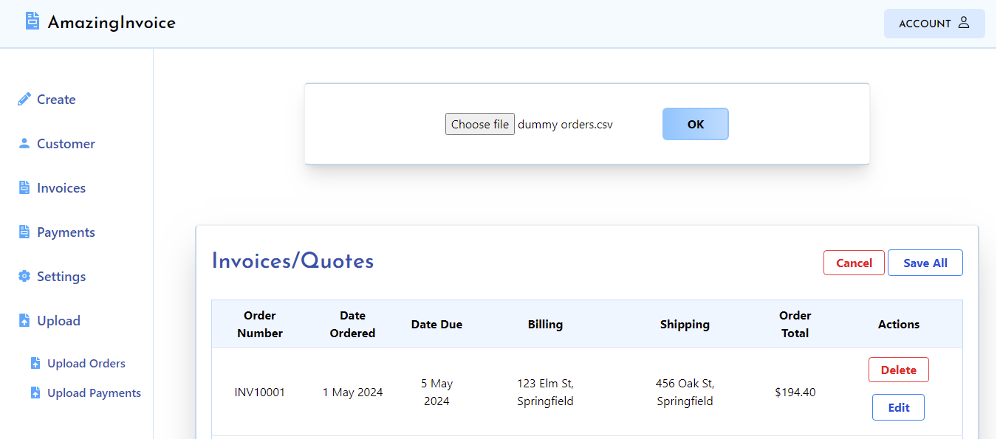
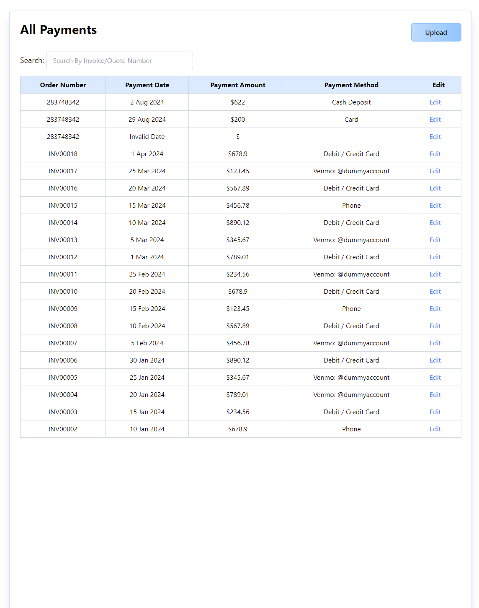

<!DOCTYPE html>
<html lang="en">
<head>
    <meta charset="UTF-8">
    <meta name="viewport" content="width=device-width, initial-scale=1.0">
    <title>MERN Invoicing Application</title>
    
</head>
<body>
    <h1>MERN Invoicing Application</h1>
    
    <h2>Overview</h2>
    
This is a full-stack invoicing application built using the <strong>MERN (MongoDB, Express, React, Node.js)</strong> stack. The application allows users to create, manage, and print invoices efficiently. It supports authentication, secure data storage, and exporting invoices in <strong>PDF</strong> or <strong>CSV</strong> formats.

    
    <h2>Features</h2>
    <ul>
        <li><strong>User authentication</strong> (JWT-based login & registration)</li>
        <li><strong>Create, edit, and delete invoices</strong></li>
        <li><strong>Generate invoices in PDF format using jsPDF</strong></li>
        <li><strong>Export invoices to CSV using PapaParse</strong></li>
        <li><strong>Responsive UI built with React and Tailwind CSS</strong></li>
        <li><strong>API integration with MongoDB for data persistence</strong></li>
        <li><strong>File uploads using Multer</strong></li>
        <li><strong>Secure authentication with bcrypt.js</strong></li>
    </ul>
    
    <h2>Tech Stack</h2>
    <h3>Backend (Server)</h3>
    <ul>
        <li>Node.js</li>
        <li>Express.js</li>
        <li>MongoDB & Mongoose</li>
        <li>JWT for authentication</li>
        <li>bcrypt.js for password hashing</li>
        <li>Multer for file uploads</li>
        <li>dotenv for environment variable management</li>
    </ul>
    
    <h3>Frontend (Client)</h3>
    <ul>
        <li>React.js</li>
        <li>React Router for navigation</li>
        <li>Tailwind CSS for styling</li>
        <li>React Icons for UI enhancements</li>
        <li>jsPDF for PDF generation</li>
        <li>PapaParse for CSV export</li>
        <li>React-To-Print for invoice printing</li>
        <li>React-Top-Loading-Bar for improved UX</li>
    </ul>
    
    <h2>Installation</h2>
    <h3>Prerequisites</h3>
    
Ensure you have the following installed:

    <ul>
        <li><a href="https://nodejs.org/">Node.js</a></li>
        <li><a href="https://www.mongodb.com/">MongoDB</a> (local or Atlas)</li>
    </ul>
    
    <h3>Clone the Repository</h3>
    <code>
        git clone https://github.com/yourusername/mern-invoicing-app.git
        cd mern-invoicing-app
    </code>
    
    <h3>Backend Setup</h3>
    <code>
        cd server
        npm install
    </code>
    
Create a <code>.env</code> file in the <code>server</code> directory and add the following:

    <code>
        MONGO_URI=your_mongodb_connection_string
        JWT_SECRET=your_jwt_secret
        PORT=5000
    </code>
    
Run the server:

    <code>
        npm run server
    </code>
    
    <h3>Frontend Setup</h3>
    <code>
        cd client
        npm install
    </code>
    
Run the React app:

    <code>
        npm run client
    </code>
    
    <h2>Screenshots</h2>
    <h3>Login Page</h3>
    
    
    <h3>Dashboard</h3>
    
    
    <h3>Create Invoice</h3>
    
    
    <h3>Invoice List</h3>
    
    
    <h3>Invoice Details</h3>
    
    
    <h3>Invoice PDF Preview</h3>
    
    
    <h3>Customer Management</h3>
    
    
    <h3>Settings Page</h3>
    
    
    <h3>User Profile</h3>
    
    
    <h3>Registration Page</h3>
    
    
    <h3>404 Page</h3>
    
    
    <h2>Running the Application</h2>
    
Backend runs on <code>http://localhost:5000</code>

    
Frontend runs on <code>http://localhost:3000</code>

    
Ensure both are running for full functionality.

    
    <h2>Contributing</h2>
    
Feel free to <strong>fork</strong> the repository and submit <strong>pull requests</strong>. Contributions are <strong>welcome</strong>!

    
    <h2>License</h2>
    
This project is licensed under the <strong>ISC License</strong>.

    
    

    
💡 <em>Made with ❤️ by <a href="https://github.com/luqmanmatloob">Your Name</a></em>

</body>
</html>

